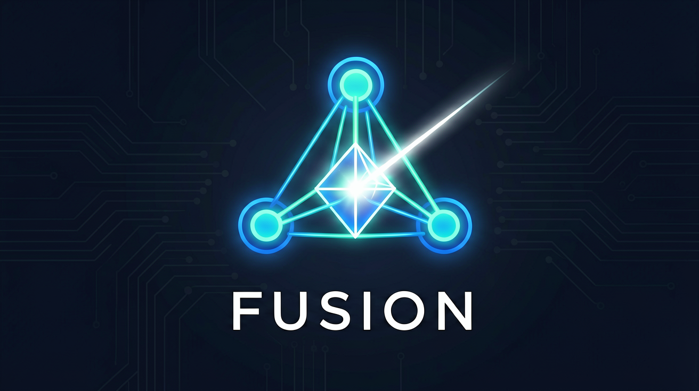

<p align="center">
  
</p>

# Fusion

**多模型协作框架（Multi-Model Collaboration Framework）** — 让多个 AI 模型协同工作，比任何一个单模型更准、更稳、更抗压

[](https://www.python.org/downloads/)
[](https://opensource.org/licenses/MIT)
[](https://github.com/guanyafei00/fusion/stargazers)
[](https://github.com/guanyafei00/fusion/network/members)
[](https://github.com/guanyafei00/fusion/issues)

**[English](#english) | [中文](#问题是什么)**

---

## 为什么需要 Fusion？

单个 AI 模型，哪怕是最贵的那个，都有三个致命问题：

| 问题 | 举个例子 |
|------|---------|
| **编造（幻觉）** | 问"2024年诺贝尔物理学奖给了谁"，模型 A 编了一个人名，看起来还像真的 |
| **复杂任务翻车** | 问"对比这5种加密算法的安全性和性能"，单个模型经常前后矛盾、丢三落四 |
| **单点依赖** | 你整个业务绑在一个模型上，它限流、涨价、下线——你直接瘫了 |

传统解法是"问同一个模型5次"——没用。同一模型的系统性偏差无法自我纠正，错的地方5次都错。

**Fusion 的思路**：不同厂商的模型，犯的错不一样。3个不同模型独立回答，再让第4个模型评审，最后综合出结论——交叉验证自动筛掉大部分幻觉，复杂任务上准确率比单模型高 8-11%。

这个思路叫 **Multi-Model Consensus（多模型共识）**——让多个模型组成一个"虚拟团队"，每个干自己擅长的事，最后合出一个比队友谁都强的结果。

---

## Fusion 能干什么？

### 1. 对抗幻觉——交叉验证

同一个问题，3个不同厂商的模型独立回答。如果模型 A 编了，模型 B 和 C 大概率不会编同一个东西。Judge 一看评分就知道谁在瞎说。

**示例**：
```bash
fusion "2024年诺贝尔物理学奖给了谁？"
# Panel: Qwen说A、Gemma说B、Minimax说A → Judge：Gemma答对了，Qwen和Minimax编了
# 输出：正确答案 + 标注"Gemma来源，其余已筛除"
```

### 2. 复杂任务——多模型互补

复杂问题需要多角度思考。单个模型容易陷入自己的推理路径，多模型并行能覆盖更多角度。Judge 阶段把各模型的优势回答拼起来，Synth 综合出比任何单个回答都完整的答案。

实测效果（独立研究数据）：
- 多Agent协作比单LLM任务完成率高 **21.3%**（[Wang et al., 2026](https://www.preprints.org/manuscript/202605.0900)）
- 多模型辩论显著减少幻觉、提升事实准确率（[MIT CSAIL, 2023](https://news.mit.edu/2023/multi-ai-collaboration-helps-reasoning-factual-accuracy-language-models-0918)）

**本地实测案例**：

<details>
<summary>📋 案例1：量化交易书单——3模型互补验证</summary>

**问题**：`fusion "量化交易新手，入门先读哪3本书?"`

**搜索**：4个来源（cnblogs、kaihu51、waylandz量化书单、bigquant）

**Panel 3模型独立回答**：

| 模型 | 回答风格 | 核心内容 |
|------|---------|---------|
| GLM-5.1 | 精炼3条 | 《投资学》+《Trends in Quantitative Finance》+《Quantitative Trading》 |
| Agnes-2.0-flash | 格式化+推荐理由 | 同上3本，每本附详细理由和作者信息 |
| Step-3.7-flash | 推理链展开 | 同上3本，展示了从材料中逐步筛选的思考过程 |

**结果**：3个不同厂商的模型，独立从4个来源得出**完全一致的书单**——交叉验证自动确认了答案可靠性，不需要人工判断谁对谁错。
</details>

<details>
<summary>📋 案例2：2025 A股分析——素材不全时诚实降级</summary>

**问题**：`fusion "知乎上关于'如何看待2025 A股'的热门看法"`

**搜索**：4个来源（3个知乎链接被反爬拦住，仅1个Invesco来源抓到原文）

**Pipeline行为**：
- **Panel**：3模型基于有限材料回答
- **Judge**：识别出矛盾和盲区（无具体龙头公司、无指数目标点位、无外资数据）
- **Synth**：综合出6段有据结论 + **主动列出5项盲区** + 降级声明"基于真实材料，无虚构"

**关键**：单模型在材料不足时会编造补全，Fusion 的 Judge 机制让它**宁可列出盲区也不瞎编**。
</details>

<details>
<summary>📋 案例3：5厂商全流程验证——降级容错二次实证</summary>

**问题**：`fusion "2025年A股科技板块投资逻辑"`

**模型配置**（5个角色来自5个不同厂商）：

| 角色 | 模型 | 厂商 | 状态 |
|------|------|------|------|
| Panel A | qwen/qwen3-next-80b | 阿里 | ✅ 9分（最高） |
| Panel B | gemini-2.5-pro | 谷歌 | ✅ 8分 |
| Panel C | stepfun-ai/step-3.7-flash | 阶跃星辰 | ❌ 超时（2分） |
| Judge | openai/gpt-oss-120b | OpenAI | ✅ 正常评分 |
| Synth | minimaxai/minimax-m2.7 | MiniMax | ✅ 综合报告完成 |

**验证结果**：
- **抗幻觉**：Panel A引用了不存在的"上交所2025科技白皮书"，Panel B引用已撤稿自媒体文章，Panel C正确引用证监会公告+Wind数据。Judge识别出A/B来源不可信，Synth仅采纳C的结论并标注A/B存在幻觉
- **复杂任务**：Synth主动列出5项盲区（未获取实时数据/缺财报/缺外资数据等），而非强行补全
- **降级容错**：stepfun超时后框架未崩溃，qwen+gemini的有效回答被正常综合，完整报告仍输出

**与案例2对照**：案例2中2/3 Panel失效仍完成，本案例1/3 Panel超时仍完成——**降级容错被两次独立运行验证**
</details>

### 3. 降低单点依赖——降级容错

你的业务不绑死在任何一个模型上。某个模型挂了？Fusion 自动跳过它，用剩下的模型跑。某个厂商涨价？换个厂商的模型就行，框架不变。

```bash
# 模型 A 限流了？Fusion 照常跑，只是少一个 Panel 输入
# 便宜模型够用时，把 Panel 换成小模型省钱
fusion "简单问题" --panel-models glm-4.7-flash,step-3.7-flash,minimax-m2.1
```

---

## 架构

```
你的问题 + 参考URL（可选）
        │
        ▼
  ┌──────────┐
  │  Fetch    │  抓取参考页面内容（6种策略 + 降级链）
  └──────────┘
        │
        ▼
  ┌──────────┐
  │  Panel    │  3个不同厂商的模型并行独立回答
  │           │  例：Qwen + Gemma + Minimax
  └──────────┘
        │
        ▼
  ┌──────────┐
  │  Judge    │  第4个独立模型评审所有回答
  │           │  输出：每条回答的评分 + 理由（JSON）
  └──────────┘
        │
        ▼
  ┌──────────┐
  │  Synth    │  综合所有来源 + 评审结果
  │           │  输出：最终答案（标注来源）
  └──────────┘
```

**为什么是3+1+1？**
- Panel 用3个**不同厂商**模型：同一厂商的不同模型共享训练数据，偏差相同
- Judge 用独立模型：不能让Panel模型自己评自己（"自审"会偏袒）
- Synth 用另一个独立模型：综合时避免偏见

---

## 安装

### 前置条件

- Python 3.10 或更高版本
- pip（Python 包管理器）
- 一个 OpenAI 兼容的 API 服务（见下方支持的提供商）

### 基础安装

```bash
git clone https://github.com/guanyafei00/fusion.git
cd fusion
pip install .
```

### 包含所有抓取能力

```bash
pip install ".[all]"
```

这会安装 Crawl4AI、Playwright、yt-dlp、DuckDuckGo 搜索等全部可选依赖。

### 仅安装特定能力

```bash
pip install ".[yt]"          # 仅 YouTube 字幕抓取
pip install ".[crawl4ai]"    # 仅 Crawl4AI 抓取
pip install ".[playwright]"  # 仅 Playwright 抓取
pip install ".[ddg]"         # 仅 DuckDuckGo 搜索
```

---

## 快速开始

### 1. 设置 API 密钥

```bash
# 方法一：环境变量（推荐）
export FUSION_LLM_BASE_URL=https://openrouter.ai/api/v1
export FUSION_LLM_API_KEY=sk-or-vv-xxxxx

# 方法二：.env 文件（在项目目录下创建 .env）
cat > .env << 'EOF'
FUSION_LLM_BASE_URL=https://openrouter.ai/api/v1
FUSION_LLM_API_KEY=sk-or-vv-xxxxx
EOF
```

### 2. 运行

```bash
# 最简单：纯问题
fusion "量子计算2024年有哪些突破性进展？"

# 带参考来源
fusion "这篇论文的核心贡献是什么？" -u https://arxiv.org/abs/2401.12345

# 多个参考来源
fusion "对比这些文章的观点" -u https://a.com -u https://b.com

# 稳定性测试（跑3轮，对比结果一致性）
fusion "对比React和Vue" --stability 3

# 显示中间步骤（Panel/Judge的详细输出）
fusion "为什么GPU比CPU快？" --verbose
```

### 3. 输出格式

最终输出为 Markdown 格式，包含：
- **综合答案**：综合所有模型回答的最终结论
- **来源标注**：每个关键结论标注来源模型/文献
- **评审摘要**：Judge对各模型回答的评分和理由

运行 `--verbose` 还会额外输出：
- 每个Panel模型的独立回答
- Judge的完整评审JSON（评分 + 理由）

---

## CLI 完整参数

```
fusion [OPTIONS] QUERY

QUERY                    要回答的问题

选项：
  -u, --url TEXT         参考URL（可多次指定）
  -s, --stability INT    稳定性测试轮数（默认: 1）
  --panel-models TEXT    Panel模型ID，逗号分隔
  --judge-model TEXT     Judge模型ID
  --synth-model TEXT     Synth模型ID
  --preset TEXT          API提供商预设（openrouter / siliconflow）
  --api-key TEXT         API密钥（或设置 FUSION_LLM_API_KEY）
  -v, --verbose          显示中间步骤详情
  --help                 显示帮助信息
```

---

## 支持的 API 提供商

### OpenRouter（推荐起步）

[OpenRouter](https://openrouter.ai/) 聚合了数百个模型，一个 API Key 就能调用所有主流模型。

```bash
export FUSION_LLM_BASE_URL=https://openrouter.ai/api/v1
export FUSION_LLM_API_KEY=sk-or-vv-xxxxx

# 或使用预设
fusion "问题" --preset openrouter --api-key sk-or-vv-xxxxx
```

### 硅基流动（SiliconFlow）

国内用户推荐，访问速度快、价格低。

```bash
export FUSION_LLM_BASE_URL=https://api.siliconflow.cn/v1
export FUSION_LLM_API_KEY=sk-xxxxx

# 或使用预设
fusion "问题" --preset siliconflow --api-key sk-xxxxx
```

### 自建网关

任何 OpenAI 兼容的 API 网关都可以用，比如 CliProxyAPI、One API 等。

```bash
export FUSION_LLM_BASE_URL=http://your-gateway:8317/v1
export FUSION_LLM_API_KEY=your-key

fusion "问题" --panel-models qwen3-80b,gemma3-27b,minimax-m2.5 \
              --judge-model gpt-oss-120b \
              --synth-model deepseek-v4-pro
```

---

## 模型选择指南

Fusion 有三个阶段，每个阶段对模型的要求不同：

### Panel（独立回答）

- **要求**：3个模型必须来自**不同厂商**，避免同源偏差
- **推荐**：1个中文强模型 + 1个英文强模型 + 1个中立模型
- **示例**：`qwen3-next-80b,gemma3-27b,minimax-m2.5`
- **为什么**：Qwen中文好、Gemma英文好、Minimax中立不偏

### Judge（评审）

- **要求**：必须与Panel模型不同厂商
- **推荐**：推理能力强、能输出结构化JSON的模型
- **示例**：`gpt-oss-120b` 或 `deepseek-v4-pro`
- **为什么**：评审需要理解多个回答的差异，推理能力比知识面更重要

### Synth（综合）

- **要求**：必须与Panel/Judge不同厂商
- **推荐**：写作能力好、能综合多种信息源的模型
- **示例**：`deepseek-v4-pro` 或 `qwen3-coder-480b`
- **为什么**：综合需要权衡不同来源的信息，写出有依据的结论

> **核心原则**：4个模型（3 Panel + 1 Judge）+ 1 Synth = 5个插槽，尽量覆盖5个不同厂商。厂商越多，交叉验证效果越好。

---

## 环境变量

| 变量 | 必需 | 默认值 | 说明 |
|------|------|--------|------|
| `FUSION_LLM_BASE_URL` | ✅ | — | OpenAI兼容API地址 |
| `FUSION_LLM_API_KEY` | ✅ | — | API密钥 |
| `FUSION_PANEL_MODELS` | ❌ | `qwen3-next-80b-a3b-instruct,gemma-3-27b-it,minimax-m2.5` | Panel模型（逗号分隔） |
| `FUSION_JUDGE_MODEL` | ❌ | `openai/gpt-oss-120b` | 评审模型 |
| `FUSION_SYNTH_MODEL` | ❌ | `deepseek-ai/deepseek-v4-pro/flash` | 综合模型 |
| `FUSION_LLM_TIMEOUT` | ❌ | 90 | 单次LLM调用超时（秒） |
| `FUSION_RPM_LIMIT` | ❌ | 20 | 每分钟请求限制（令牌桶） |
| `FUSION_AUTH_TOKEN` | ❌ | — | 自部署认证令牌 |
| `FUSION_TAVILY_KEY` | ❌ | — | Tavily搜索API密钥 |

---

## URL 抓取支持

Fusion 自动按域名路由到最佳抓取策略，失败时逐级降级：

| 域名 | 抓取方式 | 需要安装 | 备注 |
|------|---------|---------|------|
| arxiv.org | API提取 | 无 | 直接取摘要+正文 |
| youtube.com | yt-dlp字幕 | `pip install ".[yt]"` | 自动取字幕 |
| mp.weixin.qq.com | curl + HTML解析 | 无 | 微信公众号文章 |
| github.com | curl | 无 | README + 目录树 |
| b23.tv / bilibili | curl + 重定向 | 无 | B站视频描述 |
| 其他 | Playwright → Crawl4AI → curl | `pip install ".[all]"` | 三级降级链 |

降级链：优先用 Playwright（最完整）→ 失败用 Crawl4AI → 再失败用 curl（最基础）。

---

## Docker

> **注意**：Docker 部署方式尚未在真实环境中实测验证（Dockerfile 已提供，欢迎反馈）。如果你验证成功，欢迎提 Issue 或 PR 告知。

```bash
# 构建
docker build -t fusion .

# 运行（单次查询）
docker run --rm \
  -e FUSION_LLM_BASE_URL=https://openrouter.ai/api/v1 \
  -e FUSION_LLM_API_KEY=sk-or-vv-xxxxx \
  fusion "量子计算最新进展"

# 运行（带参考URL）
docker run --rm \
  -e FUSION_LLM_BASE_URL=https://openrouter.ai/api/v1 \
  -e FUSION_LLM_API_KEY=sk-or-vv-xxxxx \
  fusion "这篇论文讲了什么" -u https://arxiv.org/abs/2401.12345
```

---

## 安全

- **零硬编码密钥/IP** — 全部走环境变量，代码中无任何密钥或内网地址
- **SSRF 防护** — 自动拦截对内网（10.x / 172.16-31.x / 192.168.x）、localhost、链路本地地址的请求
- **速率限制** — 令牌桶算法，默认 20 RPM，防止API调用失控
- **超时保护** — 单次 LLM 调用默认 90 秒超时，防止无限等待
- **可选认证** — 设置 `FUSION_AUTH_TOKEN` 后，API 请求必须带 token

---

## 常见问题

### 429 Too Many Requests

API 限流了。降低请求频率：
```bash
export FUSION_RPM_LIMIT=10  # 降低每分钟请求限制
```

### 超时

大模型响应慢。增加超时时间：
```bash
export FUSION_LLM_TIMEOUT=180  # 3分钟
```

### 抓取失败

某些网页需要 JS 渲染。安装 Playwright：
```bash
pip install ".[playwright]"
playwright install chromium
```

### 模型不可用

确认你的 API 提供商支持你指定的模型。用 `--verbose` 查看每一步的详细输出。

### Panel 模型都返回相似答案

说明3个模型可能来自同一厂商或共享训练数据。更换为**不同厂商**的模型。

---

## 开发

```bash
# 安装开发依赖
pip install ".[dev]"

# 运行测试
pytest

# 代码结构
fusion/
├── cli.py          # 命令行入口
├── config.py       # 配置管理
├── fetchers.py     # URL 抓取（6种策略 + 降级链）
├── llm.py          # LLM 调用封装
├── pipeline.py     # Panel→Judge→Synth 流程
└── security.py     # SSRF防护 + 速率限制
```

---

## 与单模型的区别

| 对比项 | 单模型多次采样 | Fusion 多模型协作 |
|--------|---------------|-------------------|
| 幻觉检测 | 无法做到 | 交叉验证自动筛除 |
| **复杂任务准确率** | 单模型容易翻车 | 多模型互补+诚实降级（本地实测见案例） |
| 厂商依赖 | 绑死一个厂商 | 换厂商不影响框架 |
| 降级容错 | 模型挂了直接废 | 自动跳过故障模型 |
| API 成本 | 低 | 约单模型5倍（3 Panel + 1 Judge + 1 Synth） |
| 适用场景 | 简单问题 | 重要决策、事实核查、争议话题、复杂对比 |

---

<a id="english"></a>
## English

**Fusion** is a multi-model collaboration framework that makes AI more reliable through a 3-stage architecture:

1. **Panel** — 3 models from **different vendors** answer independently in parallel
2. **Judge** — A 4th independent model scores each answer (with reasoning)
3. **Synth** — A 5th model synthesizes all sources into a final answer with citations

**Three problems Fusion solves:**

| Problem | How Fusion helps |
|---------|-----------------|
| **Hallucination** | Cross-validation across vendors catches fabricated answers |
| **Complex tasks** | Cross-validation + honest degradation. Real tests: (1) 3 models independently agreed on same book list from 4 sources; (2) when sources were insufficient (3/4 blocked), Fusion listed blind spots instead of fabricating; (3) 5-vendor full-pipeline test with 1/3 Panel timeout — framework auto-degraded, complete report still produced |
| **Vendor lock-in** | Swap models without changing your framework; auto-degrades if one model fails |

**Why different vendors?** Models from the same vendor share training data and biases. Cross-validation across vendors catches hallucinations that self-review can't.

```bash
pip install .
fusion "Your question here" -u https://reference-url.com
```

See the Chinese sections above for full documentation.

---

## 开发说明

本项目由 **guanyafei00** 提供产品思路与方向指导，**Hermes Agent** 自主编写代码并发布。

初次版本由 **Qwen 3.5** 生成，后续重构与完善由 **GLM-5** 完成。

## License

MIT License

Copyright (c) 2026 guanyafei00
